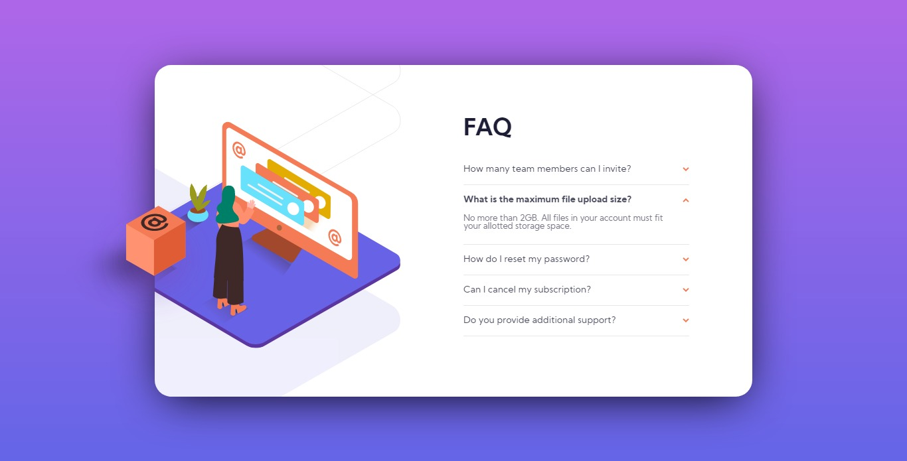
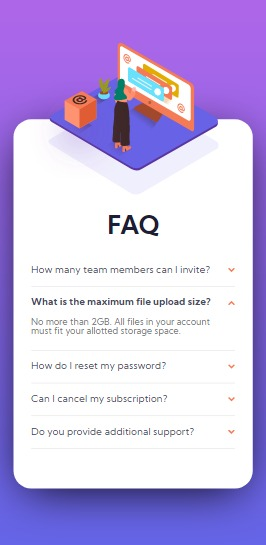

# FAQ accordion card solution

This is a solution to the [FAQ accordion card challenge on Frontend Mentor](https://www.frontendmentor.io/challenges/faq-accordion-card-XlyjD0Oam). 

## Table of contents

- [Overview](#overview)
  - [The challenge](#the-challenge)
  - [Screenshot](#screenshot)
  - [Links](#links)
- [My process](#my-process)
  - [Built with](#built-with)
  - [Useful resources](#useful-resources)
- [Author](#author)
- [Acknowledgments](#acknowledgments)

## Overview

### The challenge

Users should be able to:

- View the optimal layout for the component depending on their device's screen size
- See hover states for all interactive elements on the page
- Hide/Show the answer to a question when the question is clicked

### Screenshot

### Links

- Solution URL: [Solution URL here](https://your-solution-url.com)
- Live Site URL: [FAQ accordion card](https://lucasdemouramacedo.github.io/faq-accordion-card/)

## My process

### Built with

- Semantic HTML5 markup
- CSS custom properties
- CSS Grid
- Mobile-first workflow
- Javascript

### Useful resources

- [MDN Web Docs](https://developer.mozilla.org/) - This helped me for CSS.

## Author

- Github - [lucasdemouramacedo](https://github.com/lucasdemouramacedo)
- Frontend Mentor - [@lucasdemouramacedo](https://www.frontendmentor.io/profile/lucasdemouramacedo)
- LinkedIn - [@lucasdemouramacedo](https://www.linkedin.com/in/lucasdemouramacedo/)
- Instagram - [@lucasmouramacedo](https://www.instagram.com/lucasmouramacedo/)